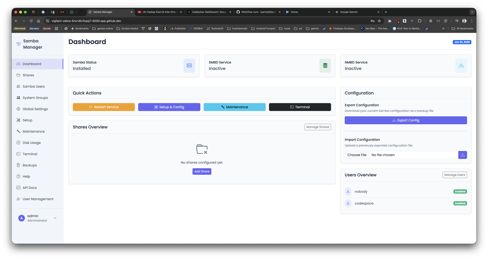
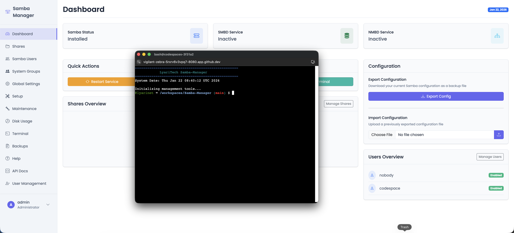
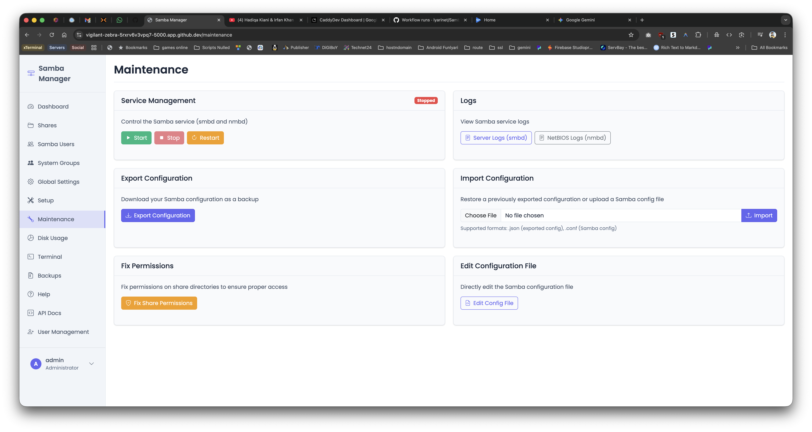
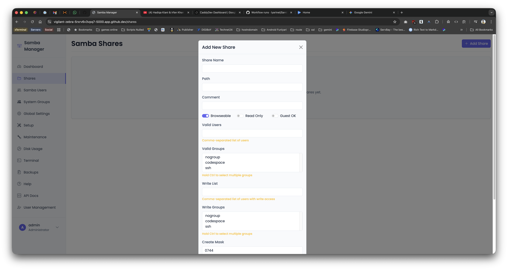

# Samba Manager

A comprehensive web-based interface for managing Samba file sharing on Linux systems.






## Features

- **Web-Based Administration**: Manage your Samba server through an intuitive web interface
- **Global Settings Management**: Configure workgroup, server string, security settings, and other global parameters
- **Share Management**: Create, edit, and delete Samba shares with advanced configuration options
  - Set path, permissions, and access controls
  - Configure user and group access restrictions
  - Set connection limits per share
  - Control browseable status and guest access
- **User Management**: Add, modify, and remove Samba users directly from the web interface
- **Group Management**: Create and manage Samba groups for easier permission management
- **Access Control**: Fine-grained control over who can access shares
  - User-specific permissions
  - Group-based access control
  - Host allow/deny restrictions
- **Service Control**: Start, stop, restart, and monitor Samba services
- **Terminal Access**: Direct terminal access to the server through the web interface
  - Secure terminal emulation using GoTTY
  - Full terminal capabilities directly in your browser
  - Available from dashboard and sidebar
- **Log Viewing**: View Samba logs directly from the web interface
- **Import/Export**: Backup and restore your Samba configuration
- **Setup Wizard**: Easy initial configuration for new installations
- **Security Features**:
  - CSRF protection on all forms
  - Rate limiting for login attempts
  - Input validation and sanitization
  - Secure password hashing
  - No default credentials
- **Multi-Mode Operation**:
  - Development mode for testing without system modifications
  - Production mode for actual system configuration management

## Requirements

- Linux system (Ubuntu, Debian, Fedora, RHEL, CentOS, Arch Linux, or Manjaro)
- Python 3.6+
- Samba server
- Sudo access (for modifying system Samba configuration)
- Go (for terminal feature using GoTTY)
- Docker 20.10+ (for Docker deployment - optional)

## Installation Methods

### Docker Deployment (Recommended for Testing)

Quickest way to try Samba Manager:

#### Option A: Using Docker Compose (Local)
```bash
cd releases/docker
docker-compose up
```

#### Option B: Using Docker Hub (Pre-built)
```bash
docker run -d -p 5000:5000 lyarinet/samba-manager:1.3.0
```

**Docker Hub**: https://hub.docker.com/r/lyarinet/samba-manager

Access at: `http://localhost:5000`

### Quick Installation (Recommended)

#### Option 1: Authentication-enabled Installation (Recommended)

If you're encountering authentication issues with GitHub, use this installation method:

```bash
# Download the authentication-enabled installer
wget https://raw.githubusercontent.com/lyarinet/Samba-Manager/main/install_with_auth.sh

# Make it executable
chmod +x install_with_auth.sh

# Run it with sudo
sudo ./install_with_auth.sh
```

#### Option 2: One-line Installation

If you have direct access to the repository, install Samba Manager with a single command:

```bash
curl -sSL https://raw.githubusercontent.com/lyarinet/Samba-Manager/main/auto_install.sh | sudo bash
```

Or if you prefer wget:

```bash
wget -qO- https://raw.githubusercontent.com/lyarinet/Samba-Manager/main/auto_install.sh | sudo bash
```

That's it! The script will automatically:
- Detect your Linux distribution
- Install all required dependencies
- Set up Samba Manager as a system service
- Configure firewall rules if needed
- Start the service

After installation, access Samba Manager at: `http://your-server-ip:5000`

### Manual Installation Options

#### Option 3: Download and Review the Script First

If you prefer to review the installation script before running it:

1. Download the script:
   ```bash
   wget https://raw.githubusercontent.com/lyarinet/Samba-Manager/main/auto_install.sh
   ```

2. Make it executable:
   ```bash
   chmod +x auto_install.sh
   ```

3. Run it:
   ```bash
   sudo ./auto_install.sh
   ```

#### Option 4: Distribution-Specific Installation

#### Ubuntu/Debian
```bash
# Install dependencies
sudo apt-get update
sudo apt-get install -y git python3 python3-pip python3-venv samba samba-common smbclient

# Clone the repository
git clone https://github.com/lyarinet/Samba-Manager.git
cd Samba-Manager

# Run the installation script
sudo ./install.sh
```

#### Fedora/RHEL/CentOS
```bash
# Install dependencies
sudo dnf update -y
sudo dnf install -y git python3 python3-pip samba samba-client

# Clone the repository
git clone https://github.com/lyarinet/Samba-Manager.git
cd Samba-Manager

# Run the installation script
sudo ./install_all_distros.sh
```

#### Arch Linux/Manjaro
```bash
# Install dependencies
sudo pacman -Syu --noconfirm
sudo pacman -S --noconfirm git python python-pip samba

# Clone the repository
git clone https://github.com/lyarinet/Samba-Manager.git
cd Samba-Manager

# Run the installation script
sudo ./install_all_distros.sh
```

#### Option 5: Developer Installation

For development or testing without system-wide installation:

```bash
# Clone the repository
git clone https://github.com/lyarinet/Samba-Manager.git
cd Samba-Manager

# Create a virtual environment
python3 -m venv venv
source venv/bin/activate

# Install dependencies
pip install -r requirements.txt

# Run in development mode
python run.py --dev
```

## Docker Deployment

Samba Manager includes production-ready Docker support for easy containerized deployment:

### Docker Features
- **Pre-configured** - All dependencies included
- **Production-ready** - Based on Python 3.12 Debian Bookworm
- **Services included** - Samba Manager (5000) + Samba daemon (139, 445)
- **Persistent storage** - Volumes for configuration and logs
- **Auto-restart** - Process supervision with automatic restart
- **Health checks** - Built-in monitoring and health endpoints

### Quick Docker Start
```bash
cd releases/docker
docker-compose up
```

For more details, see the [releases/docker/](releases/docker/) directory.

## Release Management System

Samba Manager includes a comprehensive release management system with automated tools:

### Release Tools
- **build_release.sh** - Create tar.gz and zip packages with SHA-256 checksums
- **validate_release.sh** - Validate release integrity (15+ checks)
- **publish_release.sh** - Publish to GitHub with automated uploads
- **generate_changelog.sh** - Generate changelog from git commits

### Building a Release
```bash
./build_release.sh    # Build packages
./validate_release.sh # Verify integrity
./publish_release.sh  # Publish to GitHub
```

### Release Documentation
- **[START_HERE.md](START_HERE.md)** - Quick start guide
- **[RELEASE_PACK.md](RELEASE_PACK.md)** - Quick reference commands
- **[RELEASE_WORKFLOW.md](RELEASE_WORKFLOW.md)** - Complete guide (500+ lines)
- **[RELEASE_PACK_OVERVIEW.md](RELEASE_PACK_OVERVIEW.md)** - Comprehensive overview
- **[releases/README.md](releases/README.md)** - Distribution guide

For complete release details, see [RELEASE_WORKFLOW.md](RELEASE_WORKFLOW.md).

## Uninstalling Samba Manager

If you need to remove Samba Manager from your system, you can use the uninstall script:

```bash
# Use the convenient uninstall command:
sudo samba-manager-uninstall

# Or if you're in the Samba Manager directory:
sudo ./uninstall.sh

# Or if Samba Manager is installed system-wide:
sudo /opt/samba-manager/uninstall.sh
```

The uninstall script will:
- Stop and disable the Samba Manager service
- Remove the systemd service file
- Remove the commands from /usr/local/bin
- Delete all Samba Manager files from /opt/samba-manager
- Terminate any active terminal sessions

Note: The uninstall script will NOT remove Samba itself or your Samba configuration files. Only the Samba Manager web interface will be removed.

## After Installation

### Access the Web Interface
Open your browser and navigate to: `http://your-server-ip:5000`

### First-Time Setup

**No default credentials are provided for security reasons.**

1. **Access the Web Interface**: Open your browser and navigate to: `http://your-server-ip:5000`

2. **First-Time Registration**: 
   - You'll be redirected to the login page
   - Click on "Register" or navigate to `/register`
   - Create your first admin user account
   - Check the "Admin" checkbox to grant administrator privileges
   - The first user created will automatically become the system administrator

3. **Login**: Use your newly created credentials to log in

4. **Secure Your Account**: 
   - Change your password regularly
   - Use strong, unique passwords
   - Consider enabling additional security measures

### User Management

- **Admin Users**: Can create, modify, and delete other users
- **Regular Users**: Can access shares based on permissions set by administrators
- **User Registration**: Only administrators can create new user accounts after the initial setup
- **Password Management**: Administrators can reset user passwords

### Managing the Service
```bash
# Start the service
sudo systemctl start samba-manager.service

# Stop the service
sudo systemctl stop samba-manager.service

# Restart the service
sudo systemctl restart samba-manager.service

# Check the status
sudo systemctl status samba-manager.service
```

### Running Manually
You can also run Samba Manager manually:
```bash
sudo samba-manager
```

### Network Access
If you're having trouble accessing Samba Manager from other computers on your network, you can run the network access fix script:

```bash
sudo /opt/samba-manager/fix_network_access.sh
```

This script will:
- Configure the web interface to listen on all network interfaces
- Configure the terminal service to listen on all network interfaces
- Update firewall rules to allow access to ports 5000 (web interface) and 8080 (terminal)
- Restart both services to apply the changes

After running this script, you should be able to access Samba Manager from any computer on your network using:
- Web interface: `http://your-server-ip:5000`
- Terminal: `http://your-server-ip:8080`

## Setup Guide

1. **First-Time Setup**: Access the web interface and create your first admin user account
2. **Global Settings**: Configure your workgroup, security settings, and other global parameters
3. **Add Users**: Create additional Samba users that will access your shares (admin users can create accounts)
4. **Create Shares**: Set up the directories you want to share
5. **Configure Permissions**: Set appropriate permissions for each share
6. **Restart Service**: Apply changes by restarting the Samba service

## Terminal Feature

The Samba Manager includes a built-in terminal feature that provides direct access to the server's command line through your web browser:

### Using the Terminal

1. **Access Methods**:
   - Click the Terminal button in the Quick Actions section of the Dashboard
   - Click the Terminal link in the sidebar navigation

2. **Terminal Features**:
   - Full terminal emulation in your browser
   - Automatic installation of required components (Go and GoTTY)
   - Resizable terminal window
   - Persistent sessions

3. **Technical Details**:
   - Uses GoTTY for terminal emulation
   - Runs on port 8080 by default
   - Starts automatically with the Samba Manager application
   - Terminal service can be manually started using `./start_terminal_service.sh`

For detailed documentation on the terminal feature, please refer to [TERMINAL.md](TERMINAL.md).

## Security Considerations

- **No Default Credentials**: The application starts with no pre-configured users for enhanced security
- **First-Time Setup**: Secure initial administrator account creation process
- **Strong Passwords**: Use complex passwords and change them regularly
- **Network Security**: Restrict access to the web interface using a firewall
- **Sudo Access**: The application requires sudo access to modify system configuration files
- **Custom Sudo Rules**: Consider setting up specific sudo rules for production environments
- **HTTPS**: For production use, configure a proper HTTPS setup using a reverse proxy
- **Terminal Security**: The terminal feature provides full system access - restrict application access accordingly
- **CSRF Protection**: All forms are protected against Cross-Site Request Forgery attacks
- **Rate Limiting**: Login attempts are rate-limited to prevent brute force attacks
- **Input Validation**: All user inputs are validated to prevent command injection attacks

## Troubleshooting

If you encounter issues during installation or usage:

1. **Check Logs**: Review logs in the Maintenance section or in `/opt/samba-manager/logs/`
2. **Verify Permissions**: Ensure proper file system permissions on shared directories
3. **Service Status**: Confirm Samba services are running
4. **Network Access**: Verify network connectivity and firewall settings
5. **Terminal Issues**: If the terminal doesn't appear, check that GoTTY is installed and running on port 8080
6. **See the Troubleshooting Guide**: Refer to [TROUBLESHOOTING.md](TROUBLESHOOTING.md) for common issues
7. **Release Build Issues**: For release management help, see [RELEASE_WORKFLOW.md](RELEASE_WORKFLOW.md#troubleshooting)

## Advanced Configuration

- **Custom Samba Configuration**: Edit the Samba configuration directly in the advanced mode
- **Host Restrictions**: Limit access to shares by IP address or network
- **Connection Limits**: Set maximum number of connections per share
- **User Management**: Create specific users for Samba access
- **Terminal Configuration**: Customize terminal settings in `~/.gotty/config.toml`

## Documentation

### Setup & Installation
- [INSTALL.md](INSTALL.md) - Detailed installation for all distributions
- [TROUBLESHOOTING.md](TROUBLESHOOTING.md) - Common issues and solutions
- [TERMINAL.md](TERMINAL.md) - Terminal feature guide

### Release Management
- [START_HERE.md](START_HERE.md) - Release pack quick start
- [RELEASE_PACK.md](RELEASE_PACK.md) - Release commands reference
- [RELEASE_WORKFLOW.md](RELEASE_WORKFLOW.md) - Complete release process
- [RELEASE_PACK_OVERVIEW.md](RELEASE_PACK_OVERVIEW.md) - Full release documentation
- [releases/README.md](releases/README.md) - Distribution guide

### Deployment
- [releases/docker/](releases/docker/) - Docker deployment guide

## Contributing

Contributions are welcome! Please feel free to submit a Pull Request. See [CONTRIBUTING.md](CONTRIBUTING.md) for guidelines.

## License

MIT License

## Author

Developed by AsifAgaria by Lyarinet.

---

## Screenshots





